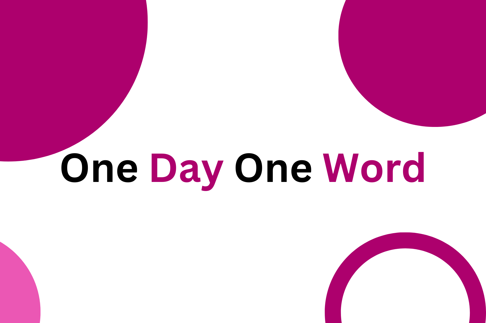

## Overview
This Bot is a simple bot designed to send an English word to a specified channel every day. This bot is a fun and educational way to expand your vocabulary and engage with your audience or community members.

> [!NOTE]  
> I got the words from the website <a href="https://www.oxfordlearnersdictionaries.com/wordlists/oxford3000-5000">`Oxford Learner's Dictionaries`</a> and their meanings from `Google Translate`.

## Running the Project
```gradle
./gradlew run --args=botToken
```

> [!NOTE]  
> This command works for me on Windows. If you're using Linux or macOS, please modify it accordingly for your platform if needed.

## Contributing
Contributions to the Trending Repositories repo are welcome! If you encounter issues or have suggestions for improvements, please feel free to open an issue or submit a pull request.

## License
This repository is licensed under the [MIT License](https://choosealicense.com/licenses/mit/).